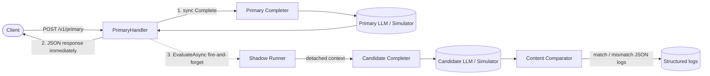
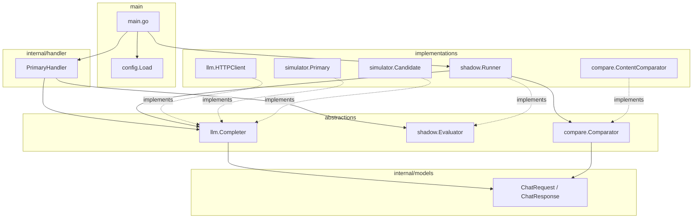
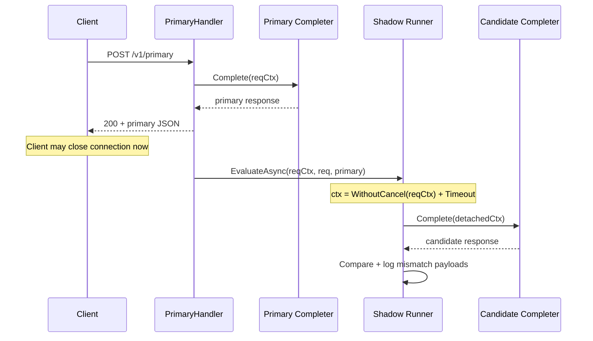
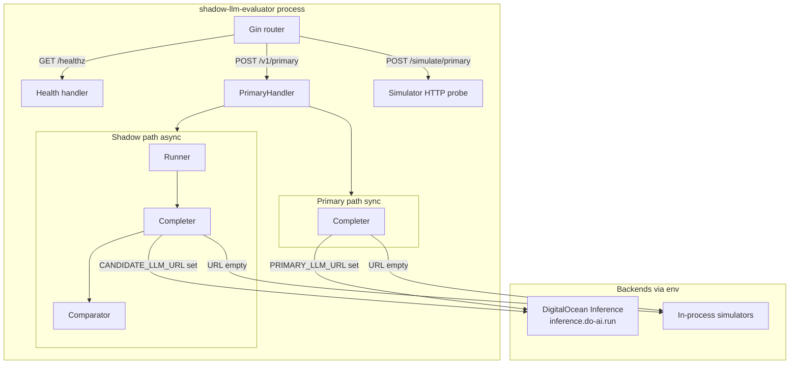
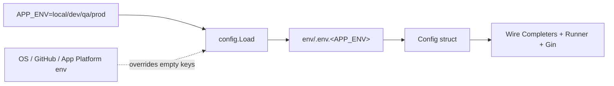
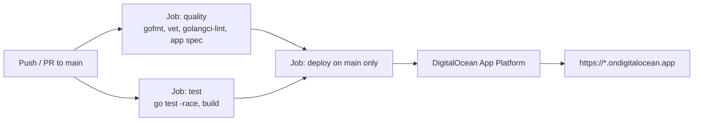

# Architecture — shadow-llm-evaluator

This service exposes a synchronous primary LLM API and asynchronously shadow-evaluates a candidate model. The user always gets the primary response immediately; candidate work continues even if the client disconnects.

---

## 1. High-level request flow



**Steps**

1. Client calls `POST /v1/primary` with chat messages.
2. Handler calls the **primary** Completer synchronously and returns that response.
3. Handler triggers **shadow** evaluation in a background goroutine.
4. Shadow runner calls the **candidate** Completer, compares outputs, and logs mismatches as clean JSON.

---

## 2. Package architecture (SOLID)



| Principle | How it shows up |
|-----------|-----------------|
| **S**ingle responsibility | Handler = HTTP; Runner = async shadow; Comparator = diff; HTTPClient = remote calls |
| **O**pen/closed | New Completers (sim / HTTP / other) without changing handler |
| **L**iskov | Any `Completer` can be primary or candidate |
| **I**nterface segregation | Small `Completer`, `Evaluator`, `Comparator` interfaces |
| **D**ependency inversion | Handler depends on interfaces, not concrete LLM clients |

---

## 3. Shadow context survival

Gin cancels `c.Request.Context()` when the client disconnects. Shadow work must **not** use that cancellation.



Key API: `context.WithoutCancel(reqCtx)` + `context.WithTimeout(...)`.

---

## 4. Component map (runtime)



---

## 5. Configuration & environments



| File | Typical use |
|------|-------------|
| `env/.env.local` | Simulators, no DO key |
| `env/.env.dev` | DO Inference + router |
| `env/.env.qa` | DO Inference (required key/models) |
| `env/.env.prod` | DO Inference (required key/models) |

Important env vars: `PRIMARY_LLM_URL`, `CANDIDATE_LLM_URL`, `PRIMARY_MODEL`, `CANDIDATE_MODEL`, `MODEL_ACCESS_KEY`.

---

## 6. CI/CD & deploy



Secrets (GitHub Actions):

- `DIGITALOCEAN_ACCESS_TOKEN` — App Platform deploy
- `MODEL_ACCESS_KEY` — Inference Bearer token injected into the app

---

## 7. Directory layout

```text
shadow-llm-evaluator/
├── main.go                 # wire config, completers, routes
├── Dockerfile
├── .do/app.yaml            # App Platform spec
├── .github/workflows/      # CI/CD
├── env/                    # .env.local / .dev / .qa / .prod
├── docs/
│   └── architecture.md     # this file
└── internal/
    ├── config/             # load env files → Config
    ├── handler/            # HTTP adapters
    ├── llm/                # Completer + HTTP client
    ├── shadow/             # async evaluator
    ├── compare/            # primary vs candidate diff
    ├── models/             # request/response DTOs
    └── simulator/          # local fake primary/candidate
```

---

## 8. Mismatch logging shape

When primary and candidate assistant contents differ, logs include clean JSON payloads:

```json
{
  "msg": "shadow evaluation mismatched",
  "primary_payload": {
    "model": "…",
    "content": "…",
    "extracted_json": {}
  },
  "candidate_payload": {
    "model": "…",
    "content": "…",
    "extracted_json": {}
  }
}
```
